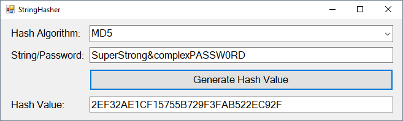
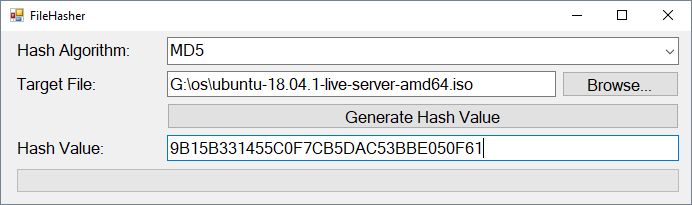

# LearnPracticalCrypto

A selection of simple tools to help learn the fundamentals of practical crypotgraphy in InfoSec. 

I teach a second year bachelors degree Information Security paper. In the paper, we focus heavily on practical security. One of the first things we cover is cryptography, from a very practical approach, including learning about hashing strings, password and files. This repository hosts a collection of simple tools I have written to work in conjunction with practical lab exercises. The summary of the tools are provided below.

## StringHasher

A very simple string/password hashing tool written in C# for use on Windows operating systems. The purpose of the tool is to introduce students to practical uses of cryptographic hashing algorithms. The tool takes sting input in a textbox, and calculates the resultant hash value. Additionally, you can select from the MD5, SHA1, SHA256 and SHA512 hash algorithms.

## SimpleFileHasher

A simple file hasher written in C# for use on Windows operating systems. The purpose of the tool is to introduce students to hashing files to ensure data integrity. For example, downloading a Linux distribution ISO, then checking the hash value. The tool takes a file as input: either using the _Browse..._ button, or by dragging and dropping the file into the _Target File_ input box. The tool supports the MD5, SHA1, SHA256 and SHA512 hash algorithms. Even though the tool is called _simple_, it is quite robust, using background workers for hash calculation (to stop the interface hanging on large sized files) and comes included with a progress bar to visually display hash calculation progress.

