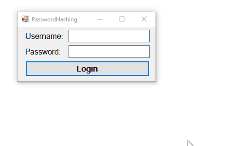

# LearnPracticalCrypto

A selection of simple tools to help learn the fundamentals of practical cryptography in InfoSec. 

I teach a second-year bachelors degree Information Security paper. In the paper, we focus heavily on practical security. One of the first things we cover is cryptography, from a very practical approach, including learning about hashing strings, password, and files. This repository hosts a collection of simple tools I have written to work in conjunction with practical lab exercises. The summary of the tools is provided below.

## StringHasher

A very simple string/password hashing tool is written in C# for use on Windows operating systems. The purpose of the tool is to introduce students to practical uses of cryptographic hashing algorithms. The tool takes sting input in a textbox and calculates the resultant hash value. Additionally, you can select from the MD5, SHA1, SHA256, and SHA512 hash algorithms.


NOTE: The StringHasher tool is specifically designed for learning purposes. All of the implemented hashing algorithms are not deemed suitable for secure password storage. It is recommended to use modern, iterative, computationally intensive hashing algorithms for secure password storage (e.g., bcrypt, argon2, and PBKDF2).

## SimpleFileHasher

A simple file hasher is written in C# for use on Windows operating systems. The purpose of the tool is to introduce students to hashing files to ensure data integrity. For example, downloading a Linux distribution ISO, then checking the hash value. The tool takes a file as input: either using the _Browse..._ button, or by dragging and dropping the file into the _Target File_ input box. The tool supports the MD5, SHA1, SHA256, and SHA512 hash algorithms. Even though the tool is called _simple_, it is quite robust, using background workers for hash calculation (to stop the interface hanging on large sized files) and comes included with a progress bar to visually display hash calculation progress.


## RandomSaltGenerator

A simple application that generates a random salt value, written in C# for use on Windows operating systems. The purpose of the tool is to introduce students to the premise of _salted hashes_, and provide a simple application to generate a random salt value. The tool requires selection of a salt length (various hard-coded length are available including 32, 64, 128 and 512 bytes). After selecting the salt length, you can simply use the _Generate Random Salt_ button and a random salt will be generated. 


NOTE: The RandomSaltGenerator tool is specifically designed for learning purposes. Random number generation is achieved using the `RNGCryptoServiceProvider` class. After a lot of researching, I could not confirm that this implementation is FIPS compliant.

## PasswordHashing

A simple application that replicates an application login scenario, written in C# for use on Windows operating systems. The purpose of the tool is to introduce students to the general process of a password login system. When the application is run, the user is presented with a username and password text boxes. When a user enters in credentials and clicks the _Login_ button the entered credentials are comapred against a palintext file of valid users. 



An example plaintext file is displayed below:

```
bob:salt:B305CADBB3BCE54F3AA59C64FEC00DEA
easy:salt:8A3F7799B5167EA29EE7B17FB967DC04
hard:salt:D71EE0ECD72033250E982BC3C6013D0D
difficult:salt:B931D5031D155DCF03750A0131EC316F
```

The plaintext file must be called `credentials.txt` and have the following format:

```
<username>:<salt_value>:<hashed_password>
```

The salting method used is: 

```
hashed_password(password + salt)
```
